# 🎉 GitHub Actions Setup Complete!

## ✅ What's Been Created

Your repository now has a **complete CI/CD pipeline** with the following files:

### 📋 Workflow Files

1. **`.github/workflows/ci-build.yml`**
   - Continuous Integration build
   - Runs on every push and pull request
   - Validates that your code builds correctly
   - Uploads VSIX artifacts (30-day retention)
   - Uploads Build Artifacts ZIP (DLLs, PDBs) for debugging

2. **`.github/workflows/build-and-release.yml`**
   - Automated release creation
   - Triggers when you push a version tag (e.g., `v1.0.0`)
   - Creates a GitHub Release with VSIX attached
   - Auto-generates release notes
   - Includes Build Artifacts ZIP for developers

### 📚 Documentation Files

3. **`.github/GITHUB_ACTIONS_GUIDE.md`**
   - Complete guide to using the GitHub Actions
   - Explains all workflows in detail
   - Troubleshooting section
   - Publishing to VS Marketplace (optional)

4. **`.github/QUICK_START_RELEASE.md`**
   - Step-by-step instructions for your first release
   - Quick command reference
   - Release checklist
   - Troubleshooting common issues

5. **`.github/ACTIONS_STRUCTURE.md`**
   - Technical documentation of the workflows
   - Configuration options
   - Monitoring and analytics
   - Best practices

### 📄 Other Updates

6. **`README.md`** (updated)
   - Added status badges for CI build and releases
   - Updated description to mention Visual Studio extension

---

## 🚀 How to Create Your First Release

### Quick Version (Copy-Paste)

```bash
# 1. Update version in source.extension.vsixmanifest
# Change: <Identity ... Version="1.0" ... />
# To:     <Identity ... Version="1.0.0" ... />

# 2. Commit and push
git add .
git commit -m "Prepare for v1.0.0 release"
git push origin master

# 3. Create and push tag
git tag v1.0.0
git push origin v1.0.0

# 4. Done! GitHub Actions creates the release automatically! 🎉
```

### Where to Check

1. **Actions progress:** https://github.com/KeyserDSoze/NetworkWatcher/actions
2. **Your release:** https://github.com/KeyserDSoze/NetworkWatcher/releases

---

## 📊 What Happens Next

### On Every Push (CI Build)

```mermaid
graph LR
    A[Push Code] --> B[GitHub Actions Triggered]
    B --> C[Build Debug]
    C --> D[Build Release]
    D --> E[Upload VSIX Artifact]
    E --> F[✅ Success!]
```



**Result:** You get a downloadable VSIX file to test from the Actions tab

### On Version Tag (Release)

```mermaid
graph LR
    A[Push Tag v1.0.0] --> B[GitHub Actions Triggered]
    B --> C[Build Release]
    C --> D[Create GitHub Release]
    D --> E[Attach VSIX File]
    E --> F[🎉 Public Release!]
```



**Result:** Users can download the VSIX from the Releases page

---

## 🎯 Benefits You Get

### 1. **Professional Distribution**
✅ Users download from GitHub Releases (not email/dropbox)  
✅ Version history visible to everyone  
✅ Automatic release notes from commits  

### 2. **Build Validation**
✅ Every push is built automatically  
✅ Catch build errors before merging  
✅ Pull requests show build status  

### 3. **Time Savings**
✅ No manual VSIX building  
✅ No manual file uploads  
✅ One command = complete release  

### 4. **Traceability**
✅ Every release linked to a Git tag  
✅ Download counts tracked  
✅ Build logs preserved  

---

## 🔖 Quick Reference Card

### Create Release
```bash
git tag v1.0.0 && git push origin v1.0.0
```

### Delete Tag (if mistake)
```bash
git tag -d v1.0.0 && git push origin :refs/tags/v1.0.0
```

### View Actions
```
https://github.com/KeyserDSoze/NetworkWatcher/actions
```

### View Releases
```
https://github.com/KeyserDSoze/NetworkWatcher/releases
```

### Manual Workflow Trigger
```
Actions → Build and Release VSIX → Run workflow
```

---

## 📈 Versioning Strategy

Use **Semantic Versioning** (MAJOR.MINOR.PATCH):

```
v1.0.0 → Initial release with core features
v1.0.1 → Bug fix (search highlighting)
v1.1.0 → New feature (export to JSON)
v1.2.0 → Another feature (filters)
v2.0.0 → Breaking change (UI redesign)
```

**Key Rule:** Users understand what changed by the version number!

---

## 🛡️ Status Badges

Your README now includes these badges:

- **CI Build Status** - Shows if latest build succeeded ✅
- **Release Status** - Shows if latest release workflow succeeded ✅
- **Latest Version** - Shows current version (e.g., v1.0.0)
- **Total Downloads** - Shows how many times users downloaded

They'll update automatically as you work!

---

## 📝 Next Steps

1. **[IMMEDIATE]** Create your first release (see Quick Version above)
2. **[SOON]** Add screenshots to releases
3. **[OPTIONAL]** Publish to Visual Studio Marketplace
4. **[OPTIONAL]** Add CHANGELOG.md to track changes
5. **[OPTIONAL]** Add demo video/GIF to README

---

## 🎓 Learn More

- **Complete Guide:** `.github/GITHUB_ACTIONS_GUIDE.md`
- **Quick Start:** `.github/QUICK_START_RELEASE.md`
- **Technical Details:** `.github/ACTIONS_STRUCTURE.md`
- **GitHub Actions Docs:** https://docs.github.com/en/actions

---

## 🎉 Congratulations!

Your **Network Watcher** extension now has:

✅ **Automated CI/CD pipeline**  
✅ **Professional release system**  
✅ **Build validation on every commit**  
✅ **One-command releases**  
✅ **Public distribution channel**  
✅ **Version tracking**  
✅ **Download analytics**  

**You're ready to share your extension with the world!** 🌍

---

## 💡 Tips

1. **Test First Release Soon**
   - Create `v1.0.0` as a test
   - Verify everything works
   - Delete if needed (it's just a tag)

2. **Commit Often**
   - Commits become release notes
   - Write clear commit messages

3. **Tag When Ready**
   - Don't rush releases
   - Test locally first
   - Tag only stable versions

4. **Monitor Actions**
   - Check Actions tab regularly
   - Fix build failures quickly
   - Review artifact sizes

5. **Share Your Extension**
   - Tweet the release link
   - Post on dev forums
   - Share on LinkedIn

---

## 📞 Support

**Questions?** Check the documentation files in `.github/`

**Problems?** 
1. Read workflow logs in Actions tab
2. Verify local build works: `msbuild NetworkWatcherExtension\NetworkWatcherExtension.csproj /p:Configuration=Release`
3. Check file paths in workflows

**Ready to release?** Just push a tag! 🚀

---

**Created:** 2026-02-27  
**Version:** 1.0  
**Status:** ✅ Ready to use
